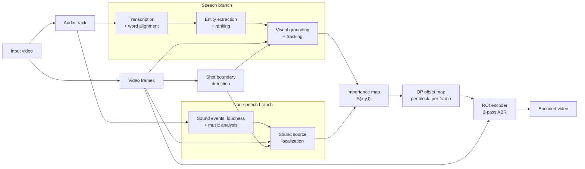

# Speech-Guided ROI Video Encoding — Design

**Status:** Draft v0.3 · **Last updated:** 2026-09-30

This is a living document. It records the decisions made so far and the open questions still to resolve.

---

## 1. Goal

Improve the viewer's quality of experience (QoE) without raising the overall bitrate. The system:

1. identifies what is important in a video from its **audio**: what is said (**speech**) and **non-speech sounds** such as sound events, loudness changes and music,
2. locates those things in the frames, and
3. **redistributes a fixed bitrate budget** toward those regions during encoding.

### Core hypothesis

When something is talked about, viewers look at it. For example, if the speech says *"The dog catching a squirrel is fun to watch,"* then the dog and the squirrel are the important regions at that moment. Salient non-speech sounds, such as a crash, a bark or a sudden loud noise, likewise pull attention toward their source on screen. Encoding these regions at higher quality should raise perceived quality more than spreading the same bits uniformly across the frame.

## 2. Scope

| In scope (current) | Out of scope (for now) |
|---|---|
| Importance derived from **speech content** (what is said) | Live / real-time encoding |
| Importance derived from **non-speech audio cues**: sound events, loudness, music | Post-processing enhancement (super-resolution, denoising) |
| Offline processing of recorded video | Adding extra bitrate on top of the budget |
| Quality control via **per-block QP offsets** during encoding | |
| **Fixed** bitrate budget, redistributed across regions | |

## 3. Design decisions so far

| # | Decision | Rationale |
|---|---|---|
| D1 | Importance comes from audio: **speech** (the entities mentioned, ranked by linguistic and prosodic cues) and **non-speech sounds** (sound events, loudness changes, music), each located at its visual source | Speech tells us *what* to look at; non-speech sounds tell us *when* something happens and, when their source is visible, *where* |
| D2 | Quality is increased by giving important regions more bitrate at encode time (negative QP offsets) | Standard, codec-compatible, measurable |
| D3 | The total budget is fixed; bits move from unimportant to important regions | Makes this a fair equal-bitrate comparison against uniform encoding |
| D4 | Rate control is 2-pass ABR (not CRF or CQP) | CRF and CQP have no bitrate target, so negative offsets would *add* bits instead of redistributing them |
| D5 | With no groundable mention and no located sound source, the QP offset map is all zeros | The encoder behaves exactly like the baseline when the audio gives no signal |

## 4. System overview



## 5. Components

### 5.1 Transcription and word alignment

- **Purpose:** turn speech into text with accurate per-word timestamps, so we know *when* each entity is mentioned.
- **Primary tool:** WhisperX (Whisper plus forced alignment).
- **Alternative:** WhisperNER for transcription plus entity tags in one pass, followed by WhisperX alignment on its (tag-stripped) text to get word timings.
- **Output:** `transcript.json` containing words, start/end times and speaker labels (if diarization is used).

### 5.2 Entity extraction and ranking

- **Purpose:** decide which mentioned things are visible objects, and how important each one is.
- **Primary approach:** an LLM reads a transcript window and returns structured entities. Speech often signals importance only implicitly, so the LLM has to infer, not just extract. §5.2.1 lists the clue types it must handle, including:
  - unnamed references ("Look!", "Wow, gorgeous!")
  - implied objects ("she's slicing" → knife, food, hands)
  - visibility cues: past, generic, hypothetical, negated, elsewhere or idiomatic mentions ("my dog back home", "raining cats and dogs")
- **Baseline approach:** spaCy noun chunks, filtered by concreteness (Brysbaert norms or WordNet physical-entity check), with a coreference model. This is used for comparison.
- **Ranking cues:** the salience clues in §5.2.1 (group C), plus the paralinguistic clues (group H).
- **Output:** `entities.json`, for example:

```json
[
  {"id": "e1", "phrase": "the dog", "role": "agent", "visible": true,
   "importance": 0.95, "t_mention": 12.40},
  {"id": "e2", "phrase": "a squirrel", "role": "patient", "visible": true,
   "importance": 0.85, "t_mention": 12.90},
  {"id": "i1", "interaction": "catching", "entities": ["e1", "e2"],
   "importance": 0.90}
]
```

### 5.2.1 Linguistic clues (brainstorm, draft)

Speech can signal importance explicitly (a named object) or only implicitly, leaving the listener to infer it. The clues below are grouped by the question each one answers.

**A. Which thing? (reference)**

| Clue | Example | What it tells us |
|---|---|---|
| Concrete noun phrase | "the dog", "a red car" | Names the object directly |
| Proper name | "Sarah", "the Eiffel Tower" | A specific person, place or product; needs a name → appearance mapping |
| Pronoun / anaphora | "it jumped", "she's laughing" | Refers back to an earlier entity |
| Cataphora | "Here it comes — the train!" | Refers forward; the referent is named after the pronoun |
| Demonstrative / deictic | "this one", "that", "over here" | A specific thing, often pointed at, often never named |
| Ellipsis (no referent at all) | "Look!", "Wow, gorgeous!", "Wait for it…" | Something is important now, but not what |
| Part of an object | "its tail", "the wheel", "her hands" | A sub-region of an object |
| General or vague noun | "the animal", "that thing", "the stuff" | A category or placeholder that must be matched to a specific object |
| Attribute description | "the one in red", "the tall guy" | Disambiguates among several instances |
| Relational description | "the cup next to the laptop" | The target object, plus a context object of lower importance |
| Ordinal / quantity | "the second jar", "all the birds", "both of them" | Which instance, or how many |
| Implied participants | "she's slicing" → knife, food, hands; "he scored!" → ball, net, player | Objects never named but implied by the action |
| Metonymy | "the kitchen smells amazing" → the food | The referent differs from the literal word |
| Speaker self-reference | "I", "my hands", "look at my shoes" | The speaker, their body or belongings |
| Vocative / addressee | "John, look at this", "you" | The person addressed on screen, or the viewer (not visual) |
| On-screen text or graphics | "as the chart shows", "read the sign" | A text or graphic region |

**B. Is it on screen now? (visibility)**

| Clue | Example | What it tells us |
|---|---|---|
| Past or future tense | "the dog caught one yesterday" | Likely not on screen (unless the footage is a flashback) |
| Temporal adverb | "last week", "later", "tomorrow" | Not now |
| Generic statement | "dogs are loyal" | A category, not a specific object |
| Hypothetical / modal | "if you had a dog", "imagine a…", "you could use a…" | Not actually present |
| Negation / absence | "there's no squirrel", "without the lid" | Absent |
| Elsewhere location | "my dog back home", "in the other room" | Exists, but off screen |
| Idiom / metaphor | "raining cats and dogs", "piece of cake" | No literal object |
| Reported speech | "she told me the dog was sick" | Usually not a current visual referent |
| Abstract noun | "the idea", "freedom", "the economy" | Not visible |
| Presentative | "here's…", "this is…", "as you can see…", "meet…" | Strongly on screen now |
| Proximal vs distal deixis | "this" vs "that" | Soft cue: "this" is more likely near and visible |

**C. How important? (salience)**

| Clue | Example | What it tells us |
|---|---|---|
| Grammatical role | "The dog chased the squirrel into the bushes" | Subject > object > background ("the bushes") |
| Perception imperatives | "look", "watch", "check out", "see" | Speaker is directing the viewer's gaze |
| Explicit importance markers | "the key part is", "notice that", "here's the trick", "pay attention to" | Speaker explicitly flags importance |
| Focus constructions | "It's the *dog* that caught it" (cleft), "That dog, I love" (fronting) | Marks the focused entity |
| Contrast | "not the cat — the dog" | The contrasted-in entity is important, the other is not |
| New vs given information | first mention vs a later "it" | A newly introduced entity draws attention |
| Repetition across the video | the dog mentioned throughout | Main topic of the video or segment |
| Evaluative predicate | "fun to watch", "beautiful", "gross" | The evaluated entity is salient |
| Intensifiers / exclamations | "really", "so cool", "look at THAT" | Raises importance |
| Interjections | "whoa!", "oh my god", "uh-oh" | Something notable is happening now, often unnamed |
| Superlative / comparative | "the biggest one", "faster than the red car" | The compared entities, the winner more so |
| Enumeration | "you'll need flour, eggs and butter" | Each item gets attention in turn |
| Question–answer | "What's he holding? A snake!" | The answer is the focus |

**D. Where on screen? (spatial)**

| Clue | Example | What it tells us |
|---|---|---|
| Screen-relative location | "on the left", "top right", "in the background" | Region of the frame |
| Object-relative location | "under the table", "next to the laptop" | Search near another object |
| Speaker-relative location | "behind me", "in my hand", "to my right" | Relative to the speaker; the speaker's right is the viewer's left |
| Distance / scale | "tiny", "way off in the distance", "up close" | Expected size of the region |
| Direction of motion | "coming toward us", "flying off to the left" | Trajectory; the region to boost ahead of the object |

**E. When? (temporal)**

| Clue | Example | What it tells us |
|---|---|---|
| Word timing | when "dog" is spoken | Baseline anchor |
| "Now" adverbs | "right now", "at this moment" | Important at the mention |
| Anticipation | "watch what happens next", "wait for it", "in a second" | An event is coming; importance should rise before it and hold until it happens |
| Retrospection | "did you see that?!", "that was close" | An event just happened; importance applies *before* the mention (possible because processing is offline) |
| Sequence markers | "first", "then", "after that" | Order of events |
| Duration | "keep watching", "the whole time" vs "blink and you'll miss it" | Sustained vs brief importance |
| Aspect | "is catching" vs "caught" vs "is about to catch" | Happening now / already happened / upcoming |

**F. What's happening? (actions and events)**

| Clue | Example | What it tells us |
|---|---|---|
| Action verb | "catching", "jumping", "pouring" | The agent, the patient and the region where they interact; motion |
| Change of state | "it's melting", "watch it explode", "turning brown" | The region where the change occurs |
| Transfer / path | "throws the ball to him" | Source, path and goal |
| Hand–object manipulation | "grab the screw", "cut along the line" | Hands plus the tool or object (tutorials) |
| Result state | "see how smooth it is now" | A region the viewer should inspect |

**G. Context and inference (implicit clues)**

| Clue | Example | What it tells us |
|---|---|---|
| Discourse topic | a segment about baking a cake | Topic objects stay important even between mentions |
| Genre | sports commentary, cooking, product review, vlog, documentary, film dialogue | Priors: ball and players; food and hands; the product; the speaker's face; the narrated subject; the speaking character |
| World knowledge / scripts | "the kettle's whistling" → kettle; "goal!" → ball, net | Objects implied by a situation |
| Implicature | "Careful!", "well, that didn't go as planned" | A hazard or a failure is visible |
| Sarcasm / irony | "oh great, just perfect" | The literal meaning is inverted; something went wrong |
| Speaker intent | advert, explanation, story | Persuasion → the product; explanation → the object being explained |
| Dialogue structure | turn-taking, reactions | The next speaker; the listener's reaction |

**H. How it's said (paralinguistic)**

| Clue | Example | What it tells us |
|---|---|---|
| Stress, pitch, loudness | a stressed "*dog*", rising pitch | The emphasized word is important |
| Reaction sounds | laughter, gasps, screams, "ooh", "aah" | A reaction to something visual; important now, referent inferred |
| Whispering vs shouting | suspense vs urgency | Intensity of attention |
| Pauses / hesitation | a dramatic pause before a reveal | An important moment is coming |
| Speech rate | fast (excited) vs slowed (emphatic) | Arousal and emphasis |
| Vocal emotion | excited, scared, disgusted | Arousal; something notable on screen |

**What each clue needs beyond the transcript**

- **Transcript text alone:** most reference, visibility, salience, temporal and event clues.
- **Audio (prosody and voice):** prosodic emphasis and all of group H. An LLM reading plain text misses these.
- **Video context:** deictic and elliptical references ("look at this!"), proper names, attribute and spatial descriptions, on-screen text.
- **Speaker identity** (diarization, active speaker detection): self-reference, vocatives, dialogue structure.

**Observations for the design**

1. Clues answer different questions (which thing, whether it's visible, how important, where, when), so the extractor's output should carry each one separately rather than a single importance score.
2. Many strong signals name no object ("Look!", "Whoa!", laughter). The system needs a fallback that decides *what* from the visuals: motion, hands, pointing gestures, what the speaker faces, visual saliency.
3. Importance can point forward ("wait for it") or backward ("did you see that?!"). Offline processing makes backward boosts possible.
4. Visibility is its own judgement. Most failures of naive noun extraction come from past, generic, hypothetical, negated, elsewhere or idiomatic mentions.
5. Genre and discourse topic set priors that persist between mentions.

### 5.3 Visual grounding and tracking

- **Purpose:** find each entity in the frames and follow it over time.
- **Primary tool:** SAM 3, which takes text prompts and returns masks for all matching instances, tracked across video.
- **Alternatives:** Grounding DINO, OWLv2, YOLO-World or Florence-2 for boxes, with SAM 2 for masks and tracking.
- **Timing rules:**
  - Search a window around the mention (initial guess: 2 s before to 5 s after).
  - Clip the window at shot boundaries (PySceneDetect).
  - Once found, track the entity through the rest of the shot.
- **Confidence gating:** only use detections above a confidence threshold. If the entity isn't found, boost nothing.
- **Prompting:** pass the full noun phrase ("the black dog"), not just the head noun, to disambiguate between instances.
- **Output:** per-frame, per-entity masks with a detection confidence.

### 5.4 Non-speech audio importance and localization

- **Purpose:** detect salient non-speech sounds, score how important they are over time, and find their source on screen.
- **Optional pre-step:** separate the soundtrack into dialogue, music and effects, so speech doesn't mask events for the tagger and each branch gets a cleaner signal.
- **Temporal importance I_ns(t)**, computed over short windows (0.5–1 s hop):
  - **Acoustic saliency:** loudness jumps relative to a running baseline, onset strength / spectral flux, and novelty ("surprise") against the recent past.
  - **Sound events:** a pretrained AudioSet tagger (PANNs, YAMNet, BEATs or AST) gives per-class probabilities. Each class gets an importance weight: crashes, gunshots, screams and barks high; wind, traffic hum and room tone low.
  - **Music:** detect music presence and changes (onsets, drops, loudness swells). Music is either:
    - *diegetic*, with a visible source such as a performer or instrument, which is grounded like any other sound; or
    - *non-diegetic* background music, which has no on-screen source.
  - Features are normalized per video (percentile), then smoothed with fast attack, slow release and hysteresis to avoid quality flicker.
- **Spatial localization:**
  - **Class-to-object mapping:** a tagged class becomes a text prompt for the grounding model in §5.3 (e.g., "dog barking" → "dog"), reusing SAM 3.
  - **Audio-visual sound source localization** (e.g., EZ-VSL) when no class maps cleanly to an object.
  - **Stereo or ambisonic cues**, when available, for rough direction.
- **No visible source:** background music and off-screen sounds get no spatial boost, rather than boosting an arbitrary region.
- **Output:** `sound_events.json` (class, time span, importance) and per-frame source masks with a localization confidence.

### 5.5 Importance map

For each speech entity *e*, the weight at time *t* is:

```
w_e(t) = importance_e × confidence_e(t) × exp(−(t − t_mention_e) / τ)
```

Importance is refreshed when the entity is mentioned again.

For each located non-speech sound source *s*, the weight is:

```
w_s(t) = β × I_ns,s(t) × confidence_s(t)
```

where β sets the weight of non-speech cues relative to speech (to be tuned).

The per-pixel importance map combines both branches:

```
S(x, y, t) = max over all speech entities e and sound sources s of [ w(t) · mask(x, y, t) ]
```

- `max` is used rather than a sum, so overlapping masks aren't double-counted.
- For an interaction, the union of the participating masks gets the interaction's weight.

### 5.6 QP offset map

1. **Block average:** downsample S to the encoder's block grid (16×16) to get S_b.
2. **Zero-mean and clamp:** `ΔQP_b = clamp(−k · (S_b − mean(S)), −8, +6)`. A zero-mean map is roughly budget-neutral before rate control acts.
3. **Spatial softening:** dilate and blur the map so there is no hard boundary between sharp and blurry areas, and so it tolerates motion and mask error.
4. **Temporal smoothing:** ramp offsets in and out over several frames to avoid visible quality pops and flicker.
5. **Neutral default:** all zeros when there is no active entity or located sound source.

Rule of thumb for choosing k: −6 QP roughly doubles a block's bits, and +6 QP roughly halves them.

### 5.7 ROI encoding

- **Encoder:** x264 (H.264) or x265 (HEVC), driven through the library API with per-frame, per-block offset arrays (x264 `quant_offsets`, x265 `quantOffsets`). An alternative is per-frame ROI side data via libavcodec.
- FFmpeg's `addroi` filter applies a static rectangle only, so it is useful for sanity checks, not the real pipeline.
- **Rate control:** 2-pass ABR at the target bitrate, with the same QP maps applied in both passes.
- **Adaptive quantization:** the encoder's AQ stays consistent (on or off) between baseline and ROI encodes.
- **Baseline:** the same encoder, settings and target bitrate, with no ROI map.

## 6. Evaluation plan

### Conditions (all at equal achieved bitrate)

1. Uniform encoding (baseline)
2. Visual-saliency ROI (shows whether audio adds value beyond visual saliency)
3. Speech-only ROI (speech branch alone)
4. Non-speech-only ROI (non-speech branch alone)
5. Combined audio-guided ROI (this system)

Conditions 3–5 show how much each branch contributes.

### Metrics

| Level | What is measured |
|---|---|
| Bitrate check | Achieved bitrate of each encode; must match within tolerance |
| Objective quality | PSNR and VMAF measured separately **inside the ROI** and **in the background**; saliency- or eye-tracking-weighted PSNR/VMAF |
| Subjective QoE | ACR test per ITU-T P.910 at equal bitrate |
| Component: extraction | Precision and recall of extracted entities against annotated references |
| Component: grounding | Mask/box IoU against annotated on-screen objects |
| Component: sound events | Event detection accuracy against annotated sound events |
| Component: sound localization | Localization accuracy (IoU or pointing) against annotated sound sources |

**Expected:** full-frame PSNR/VMAF may drop slightly because the background is deliberately degraded. This is not a failure; the ROI-specific, attention-weighted and subjective results are what count.

## 7. Tunable parameters (initial guesses)

| Parameter | Meaning | Initial value |
|---|---|---|
| τ | Importance decay after a mention | 3–5 s |
| Search window | Time range around a mention to look for the entity | −2 s to +5 s |
| Confidence threshold | Minimum detection confidence to boost a region | 0.5 |
| β | Weight of non-speech cues relative to speech | 0.5–1.0 |
| Event class weights | Importance per AudioSet class | Hand-set, then learned |
| Acoustic smoothing | Attack / release of I_ns(t) | Fast attack (~0.2 s), slow release (~2 s) |
| k | Strength of the importance → ΔQP mapping | Tune so ROI ΔQP ≈ −4 to −6 |
| ΔQP clamp | Limits on the offsets | [−8, +6] |
| Mask dilation | Margin around masks | 1–2 blocks |
| Temporal ramp | Frames to fade offsets in and out | 5–10 frames |

## 8. Risks and known issues

- **Off-screen references:** the speech mentions something that isn't visible. Mitigated by the LLM `visible` flag and confidence gating.
- **Sounds with no visible source:** background music, narration effects and off-screen noises have high importance but nothing to boost. Mitigated by giving no spatial boost when localization confidence is low.
- **Mis-localization:** a sound attributed to the wrong object (two dogs on screen, only one barking).
- **Overlapping audio:** speech, music and effects at the same time can confuse both branches. Mitigated by the optional dialogue/music/effects separation.
- **Timing mismatch:** the object appears before or after it is mentioned. Mitigated by the search window and tracking.
- **Background degradation:** at low bitrates the background may show visible blocking. Mitigated by the positive clamp.
- **Large ROIs:** if important regions cover most of the frame, there are few bits to redistribute and little gain.
- **Multiple instances:** "the dog" when several dogs are on screen. May need modifiers or an active-speaker cue.
- **Compute cost:** SAM 3 requires a GPU; per-video processing time must be measured.

## 9. Open questions

- [ ] Codec: H.264 (x264) or HEVC (x265)?
- [ ] Target content type: vlogs, documentaries, tutorials, films?
- [ ] Test dataset: existing videos, or new clips with annotations?
- [ ] Which LLM to use for entity extraction?
- [ ] Confirm offline-only processing (assumed).
- [ ] Target bitrates and resolutions for experiments.
- [ ] How to combine with a visual-saliency fallback when the audio gives no located source.
- [ ] Relative weighting of speech and non-speech importance (β), and whether it should vary by content type.
- [ ] Should non-diegetic music affect encoding at all (e.g., raising overall importance of a segment), or be ignored?

## 10. Future extensions

- Active speaker detection to boost the face of whoever is talking.
- Audio-visual saliency models (DAVE, STAViS, CASP-Net, DiffSal) as a fallback or fusion input.
- Post-processing enhancement (super-resolution) on important regions.

## 11. Change log

| Version | Date | Change |
|---|---|---|
| 0.1 | 2026-09-30 | Initial high-level design from discussion: speech-driven importance, ROI encoding with fixed budget |
| 0.2 | 2026-09-30 | Non-speech audio cues (sound events, loudness, music) moved into scope. Added non-speech branch (§5.4); updated goal, D1, D5, pipeline diagram, importance map (§5.5), evaluation conditions, parameters, risks and open questions |
| 0.3 | 2026-09-30 | Added §5.2.1: brainstormed taxonomy of linguistic clues (explicit and implicit), grouped by the question each answers. §5.2 primary approach and ranking cues now reference it |
